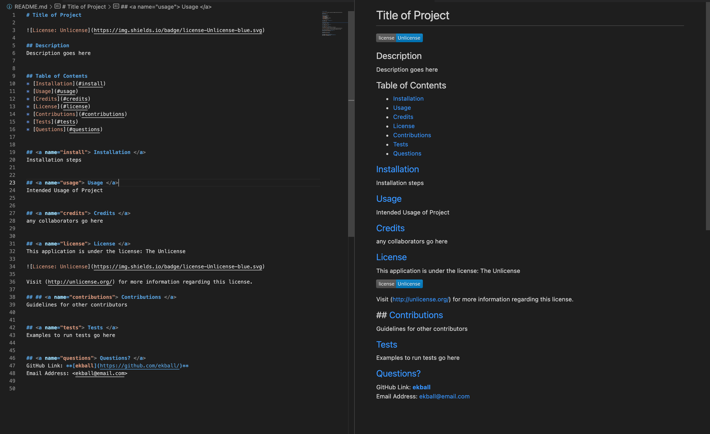

# Challenge #9 - README Generator

## Description

    This project was about using Node.js to create a backend application that would dynamically generate professional README files for programs. After the user runs the program within the terminal, it will prompt a series of questions. When answered, the program will create a new README file that is styled in a markdown.

## Experience Gained

    This challenge was different than all the previous ones in that we did not have a webpage to style and add functionality. Working on a backend project that the average person would not know how to run without knowledge of node.js was not particularly challenging, but it did allow some insight into thinking how other developers could use this code through the terminal for coding.

## GitHub Links (Repository and Demo Video)

    The repository link: https://github.com/ekball/C9-README-Generator

    The demo video link: https://watch.screencastify.com/v/9nnkvfNLQ3FvrwhAjYeZ

## Demo README

